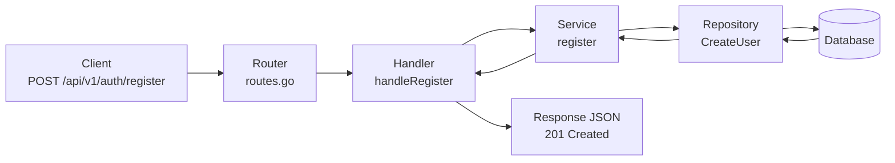
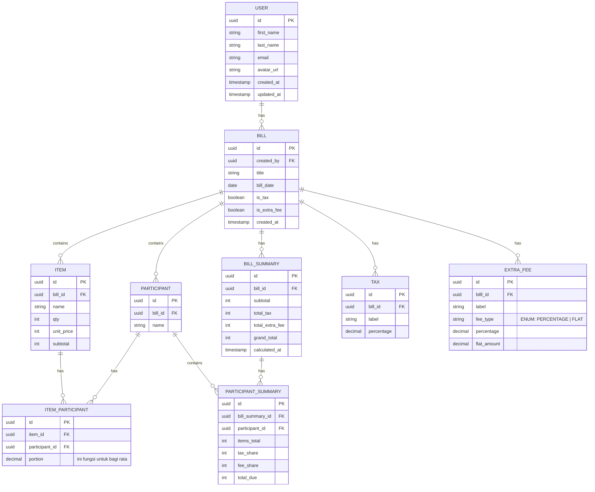

# Todo List
* [ ] s

# Flow Rest API Register 

## Flow Split bill
1. Tambah bill
2. Isi nama bill/tagihan
3. isi siapa yang ikut (ini aku masih bingung dibelakangnya disatuin sama tabel tagihan atau tidak)
4. Tambah item menu yang dipesan(disini isi nama item, qty, harga satuan, punya siapa)
5. jika sudah ada opsi menggunakan ppn atau tidak
6. jika menggunakan ppn  masukan nama pajak persentasenya
7. lalu ada opsi biaya lainnya jika ada, prosesnya harusnya sama dengan feature ppn
8. lalu pilih ringkasan untuk menampilkan hasilnya
9. pada ringkasan itu terdapat total yang harusu dibayar, subtotal(total tanpa pajak), total ppn, total biaya lainnya
10. lalu pada ringkasan terdapat section tagihan per orang 
11. lalu ada section rincian semua item, subtotal, ppn, biaya lainnya, dan total semuanya
12. lalu ada feature simpan dan bagikan rinciannya (tapi harusnya udah disimpan saat dia klik detail ringkasan)
13. jika sudah balik ke home lagi dengan menampilkan riwayat split bill

# ERD

